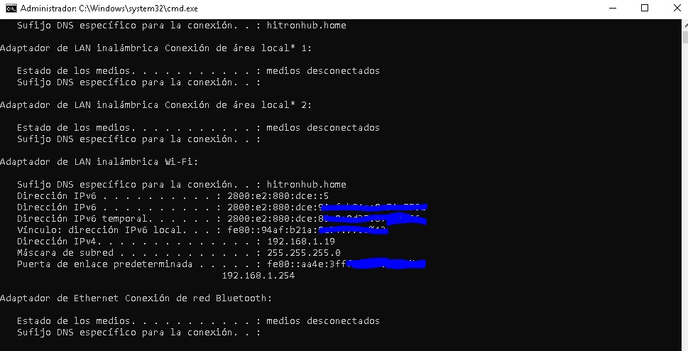

# Trabajo_final_python_ucm_entregable

Trabajo_final_python_ucm Este repositorio se crea con el fin de compartir con el profesor Cesar Muñoz Araya, el trabajo final para su materia ***Módulo de desarrollo para el pentesting*** de la especialización de ***ciberseguridad*** de la Universidad Católica de Manizales (UCM).

## En que consiste este laboratorio

*Este laboratorio pretende crear un hombre en el medio **(MITM)** para capturar los paquetes HTTP del computador víctima, por medio de un script creado con el lenguaje de programación python, para finalmente  generar un archivo .JSON con los usuarios y contraseñas capturados en los paquetes de la página: ([**Altoro Mutual**](http://altoromutual.com/login.jsp)) que se usó de ejemplo para este laboratorio, aclarando que puede servir para cualquier página HTTP.*

La finalidad de este ataque es demostrar como poder saltarse la seguridad establecida, la cual fuerza que las comunicaciones HTTP vayan sobre un canal TLS/SSL para hacer las mismas seguras. Para ello, vamos a trabajar con una idea muy sencilla, un esquema de Man in the middle (MITM), mediante el cual realizaremos modificaciones a los paquetes ARP destinados en un principio a la máquina víctima para hacer que dicho sistema viaje a través de mi kali linux. De esta manera, se consigue que el TTL(Time to live) de la configuración HSTS caduque, y por tanto, la capa de seguridad que protege las conexiones HTTP queda eliminada. Una vez eliminada la seguridad de la conexión, este se conectara ya no al router sino que lo hará a través de el equipo atacante dando la posibilidad de capturar los paquetes necesarios para darnos como resultado final, el url ingresada, el usuario y contraseña permitiéndonos obtener información sobre las web que visita la víctima.

### Protocolos:

- **ARP** -> Es el protocolo de resolución de direcciones, mediante el cual en una red interna se obtiene una dirección física a partir de una dirección IP.
- **HTTP** ->  Es un protocolo sin estado utilizado para realizar las transferencias en la World Wide Web.
- **HTTPS** -> Basado en HTTP y destinado a la transferencia segura de HTTP mediante el uso de un cifrado SSL/TLS que crea un canal de cifrado.
- **SSL/TLS** -> Son protocolos criptográficos que proporcionan comunicaciones seguras por una red. usan cifrados X.509 (asimétricos) para autenticar la contraparte con quien se estén comunicando, y para intercambiar una llave simétrica.

## Escenario
Lo primero que se hizo fue identificar las IP's de cada uno de los dispositivos que van a estar en el escenario para este laboratorio.

| IP PC Víctima | IP Router | IP PC Atacante |
| :-------- | :-------: | --------: |
| 192.168.1.19 | 192.168.1.254 | 192.168.1.24 |
| **Windows10** | **hitron** | **Kali Linux** |

## Man in the middle attack
Pasos para hacer el proceso del hombre en el medio
 1. **Identificar la mac del router**
 Para esto abrimos el terminal en el equipo victima y ejegutamos el siguiete comando: 
> ipconfig

Con este comando podemos identificar la IP del router que es **192.168.1.254**
Luego en la mista terminal del equipo víctima ejecutamos el siguiente comando:

> arp -a

Acá identificamos la mac del router, para que mas adelante cuando se cree el hombre en el medio, notar que dicha mac cambia.
 2. **Hacemos la configuración del entorno en el equipo del atacate *(kali linux)*:**
 Para ello tenemos que estar cómo usuarios root, y para iniciar el terminal cómo usuario root, ejecutamos el siguiente comando seguido de la clave:
 
> sudo -s

Una vez iniciamos cómo root, verificamos que en kali, el forward esté habilitado ***(Que sea igual a 1)*** ejecutando el siguiente comando:

> cat /proc/sys/net/ipv4/ip_forward

Si el valor es igual a cero *(0)* debemos colocarlo en uno *(1)* con el siguiente comando:

> echo 1 > /proc/sys/net/ipv4/ip_forward

Y volvemos a ejecutar el comando de **cat** para revisar si cambió de cero a uno.

 3. **Revisamos el archivo /etc/sysctl.conf**
 Para ello ejecutamos el siguiente comando:
> nano /etc/sysctl.conf

Y descomentamos dónde dice **ipv4** y **ipv6** guardamos los cambios.
**NOTA: importante DEBO REINICIAR EL SERVER** para que tome los cambios.

## Instalación y configuración de las herramientas y paquetes

Para poder realizar el ataque, se pueden utilizar varias estrategias, pero en este caso utilizaremos _spoofer_, en un script que nos permitirá realizar el ataque "man in the middle" propiamente dicho, mediante la falsificación de paquetes ARP. haciéndole creer a la victima que nuestro linux es el router, y haciéndole creer al router que nuestro linux es el host, haciendo un intermediario entre el envío de paquetes entre el router y el host (windows 10).

**Herramientas:**
 - [ ] Python *v.3.9.13*
 - [ ] pip *(gestor de paquetes de python)*

**Paquetes:**
 - [ ] scapy | ***pip install scapy***
 - [ ] scapy_http | ***pip install scapy_http***

## Ejecución del ataque

 - Primero clonamos el repositorio con el siguiente comando:

> git clone https://github.com/sebing18/Trabajo_final_python_ucm_entregable.git

 - Después nos vamos al directorio del repositorio clonado y ejecutamos el siguiente comando para validar que ya estamos dentro del repo y para saber la rama que seria main ***(master):***
 
> git branch

Una vez estemos dentro del proyecto, nos dirigimos a la carpeta **<Archivos_Entregables>** y estando dentro de la carpeta ejecutamos el script  **<sre_arp_spoofing_funcional.py>** de la siguiente forma:
> python3 sre_arp_spoofing_funcional.py

**Nota:** *Si el siguiente error sale; reiniciamos la red, con el siguiente comando y ya con esto debería arreglarse:*
> sudo systemctl restart NetworkManager.service

Y ya con esto empezamos a capturar todo el tráfico HTTP, para cancelar el proceso, presionamos **ctrl+z** y nos dirigimos al archivo JSON **<captura_paquetesKey.json>** que tendrá todos los usuarios y contraseñas capturados por HTTP.

## Capturas de pantalla, con los diferentes resultados en la creación del archivo .JSON:

 - **Con el método split**
 

 - **Creación del ciclo FOR para la variable *diccionario***
 
 

- **Usando el médoto extend**

